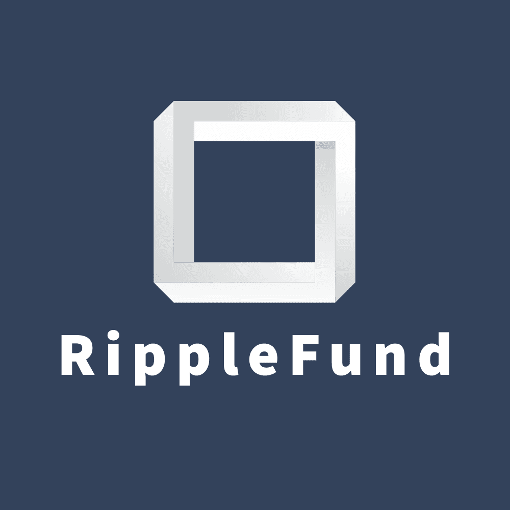

<p align="center">
  

  <h3 align="center">RippleFund - Verifier Repository</h3>

  <p align="center">
    MAS-Approved Singapore Crowdfunding Platform
  </p>

  <p align="center">
    <a href="#getting-started"><strong>Run Locally</strong></a>
  </p>
</p>

<details open="open">
  <summary>Table of Contents</summary>
  <ol>
    <li><a href="#about-the-verifier-repostiory">About The Verifier Repository</a></li>
    <li>
      <a href="#about-the-project">About The Project</a>
      <ul>
        <li><a href="#issuer-holder-verifier-flow">Issuer-Holder-Verifier Flow</a></li>
        <li><a href="#technologies-used">Technologies Used</a></li>
      </ul>
    </li>
    <li>
      <a href="#getting-started">Getting Started</a>
      <ul>
        <li><a href="#prerequisites">Prerequisites</a></li>
        <li><a href="#installation">Installation</a></li>
      </ul>
    </li>
    <li><a href="#roadmap">Roadmap</a></li>
    <li><a href="#contributing">Contributing</a></li>
    <li><a href="#acknowledgements">Acknowledgements</a></li>
  </ol>
</details>

## About The Verifier Repository

The **Verifier Repository** is the actual RippleFund platform.

The current implementation of RippleFund is a **web GUI** for RippleFund admins and KYC analysts to view the list of startups approved for crowdfunding by The Monetary Authority of Singapore (MAS) or Singapore Fintech Association (SFA).

In the future, we would like to build an actual crowdfunding platform like Kickstarter, Indiegogo and Crowdfunding to facilitate crowdfunds in Singapore for both startups and potential crowdfunding backers.

## About The Project

RippleFund uses Affinidi's verifiable credentials to build a trusted crowdfunding platform based in Singapore.

#### Singapore's Startup Ecosystem

Singapore is ranked among the top 20 startup ecosystems globally. The government offers business-incubating infrastructure, tax incentives, cash grants and financing schemes to countless ventures.

With financing being generally the largest challenge in venture building, SG has been rolling out more and more initiatives to propel Singapore towards a thriving startup ecosystem; [Startup SG](https://www.startupsg.gov.sg/) was established in 2017 to unify efforts to support the startup ecosystem under its various initiatives, programmes and partner networks.

#### About Crowdfunding

Crowdfunding is the practice of funding a new venture by raising money from the public. It stimulates innovative projects due to its interactive nature, and at the same time, using innovation to fill the financial gap that traditional financial systems are unable to. Singapore's startup ecosystem seeks to gain from such a potent new source of capital.

Though crowdfunding can make supporting and raising money for startups easier than ever, but it's not without issues. Con artists can use crowdfunding platforms to deceive donors and steal money for personal use. Or the money can be raised with the best intentions, but not end up used for its stated purpose.

#### RippleFund's Missions

1. To make crowdfunding accessible to and trusted by the public (MAS- and SAF-backed)
2. To protect crowdfunding backers from con artists and scams
3. To build trust and engagement among Singaporean startups and crowdfunding backers
4. To promote entrepreneurship as well as innovative methods of capital raising in Singapore

### Issuer-Holder-Verifier Flow


### Technologies Used

- [Affinidi API](apikey.affinidi.com)
- [React](https://reactjs.org/)
- [AWS SES](https://aws.amazon.com/ses/)
- [Cloud Firestore](https://firebase.google.com/docs/firestore)

<!-- GETTING STARTED -->

## Getting Started

### Prerequisites

#### Generate Affinidi API key

1. Go to [Affinidi's developer site](apikey.affinidi.com)
2. Register for an account
3. Store `API Key` and `API Key Hash` safely

#### Configure .env file

1. Open terminal and navigate to the project folder
2. Run `cp .env.example .env`
3. Fill in the .env file with the details that you have gathered in the previous steps

```
REACT_APP_API_KEY=<<Affinidi's API Key>>
REACT_APP_API_KEY_HASH=<<Affinidi's API Key Hash>>
REACT_APP_ENVIRONMENT=prod
REACT_APP_WALLET_URL=http://localhost:3001
```

### Installation

1. Open the terminal and navigate to the project folder
2. Run `npm install`
3. Run `cp .env.example .env`
4. Populate credentials in `.env`
5. Run `npm start`

#### Sequence

Run the [Issuer Repository](https://github.com/SmolLeaps/ripplefund-issuer), then the [Holder Repository](https://github.com/SmolLeaps/ripplefund-holder), then lastly the [Verifier Repository](https://github.com/SmolLeaps/ripplefund-verifier).

## Contributing

Contributors:

- [Carey Lai](https://github.com/careylzh)
- [Callista Chang](https://github.com/callistachang)

## Acknowledgements

Submitted for [Affinidi 'PoC'athon 2021](https://affinidipocathon.devpost.com/).
